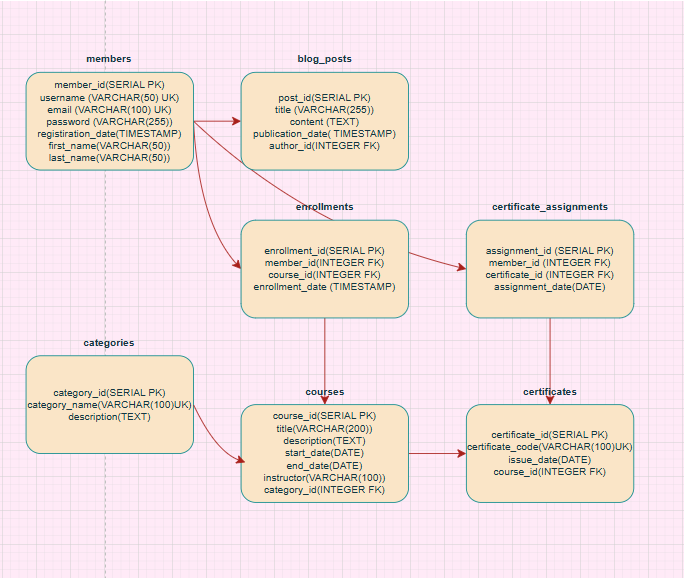

# 🎓 Çevrimiçi Eğitim Platformu Veritabanı Projesi

Bu proje, PostgreSQL kullanarak tasarlanmış bir çevrimiçi eğitim platformu veritabanı şemasıdır. Proje kapsamında üyeler kayıt olabilir, eğitimlere katılabilir, sertifika kazanabilir ve blog yazıları paylaşabilir. 

## 🧱 Veritabanı Tabloları

Bu projede aşağıdaki tablolar yer almaktadır:
-İlk olarak, istenen veritabanı yapısını anlamalıyız. Projemizde bir "Çevrimiçi Eğitim Platformu" için 7 ana tablo oluşturmamız gerekiyor:
- **members**: Platform kullanıcılarını içerir.
- **categories**: Eğitim kategorileri.
- **courses**: Eğitim detaylarını barındırır.
- **enrollments**: Üyelerin kurslara katılım bilgileri.
- **certificates**: Eğitimler sonrası verilen sertifikalar.
- **certificate_assignments**: Sertifikaların üyelere atanması.
- **blog_posts**: Üyelerin blog gönderileri.

## 🧩 Tablolar Arası İlişkiler

- members → blog_posts: Bir üye birden fazla blog yazabilir
- members → enrollments: Bir üye birden fazla kursa kaydolabilir
- courses → enrollments: Bir kursa birden fazla üye kaydolabilir
- enrollments → certificate_assignments: Kayıtlar ve sertifika atamaları arasındaki ilişki
- categories → courses: Kategoriler ve kurslar arasındaki ilişki
- courses → certificates: Bir kurs tamamlandığında alınacak sertifika

## 🧠 Performans

Proje kapsamında sorguların hızlandırılması amacıyla gerekli dış anahtarlara indeksler eklenmiştir (`CREATE INDEX` komutlarıyla).

## 🖼️ Şema Görseli

Aşağıda veritabanı ilişkilerini gösteren ER diyagramı yer almaktadır:

--------------------------------------------------------------------------------------------------------------------------------
# 🎓 Online Education Platform Database Project

This project is a PostgreSQL-based database schema designed for an online education platform. The platform allows users to register, enroll in courses, earn certificates, and share blog posts.

## 🧱 Database Tables

In this project, we need to understand and implement the structure of 7 main tables for the online platform:

- **members**: Contains information about platform users.
- **categories**: Stores course categories.
- **courses**: Includes course details.
- **enrollments**: Tracks which members are enrolled in which courses.
- **certificates**: Stores the certificates issued upon course completion.
- **certificate_assignments**: Links members with the certificates they have received.
- **blog_posts**: Stores blog posts written by members.

## 🧩 Table Relationships

- **members → blog_posts**: A member can write multiple blog posts.
- **members → enrollments**: A member can enroll in multiple courses.
- **courses → enrollments**: A course can have multiple enrolled members.
- **enrollments → certificate_assignments**: Connects course participation to certificate assignments.
- **categories → courses**: A category can have multiple courses.
- **courses → certificates**: Each certificate is linked to a course.

## 🧠 Performance Optimization

To improve query performance, indexes have been added to foreign key columns using `CREATE INDEX`.

## 🖼️ Schema Diagram

The following ER diagram visually represents the table structures and their relationships:

